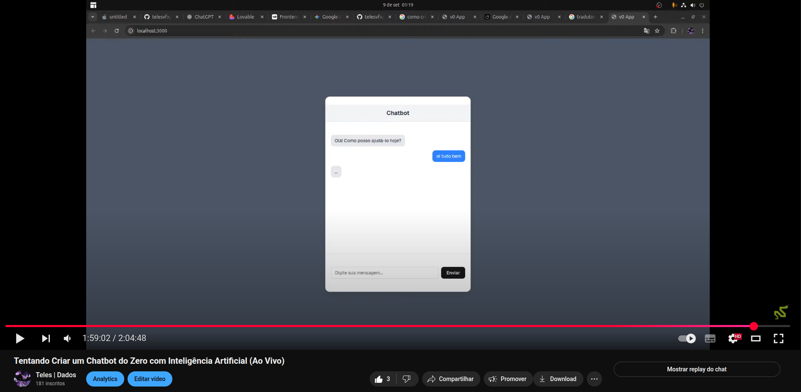

# Chatbot com Next.js e Back-end Python + API do Google Gemini

Este é um projeto de chatbot simples e funcional com uma interface moderna construída em Next.js e um back-end robusto em Python (Flask) que se conecta à poderosa API do Google Gemini para gerar respostas inteligentes.

## ✨ Funcionalidades

* **Interface Reativa:** Interface de chat limpa e responsiva construída com Next.js, TypeScript e Tailwind CSS.
* **Inteligência Artificial:** Respostas geradas em tempo real pela API do Google Gemini (`gemini-pro`).
* **Comunicação Front-end/Back-end:** Conexão desacoplada, onde o front-end (rodando na porta 3000) consome a API do back-end (rodando na porta 5000).
* **Fácil de Configurar:** Projetado para ser simples de instalar e executar em um ambiente de desenvolvimento local.

## 🛠️ Tecnologias Utilizadas

**Front-end:**
* [Next.js](https://nextjs.org/) - Framework React para produção.
* [React](https://react.dev/) - Biblioteca para construir interfaces de usuário.
* [TypeScript](https://www.typescriptlang.org/) - JavaScript com tipagem estática.
* [Tailwind CSS](https://tailwindcss.com/) - Framework de CSS para estilização rápida.
* [pnpm](https://pnpm.io/) - Gerenciador de pacotes rápido e eficiente.

**Back-end:**
* [Python](https://www.python.org/) - Linguagem de programação principal.
* [Flask](https://flask.palletsprojects.com/) - Microframework web para criar a API.
* [Google Gemini API](https://ai.google.dev/) - Modelo de IA para geração de texto.
* `python-dotenv` - Para gerenciar variáveis de ambiente de forma segura.

## 🚀 Guia de Instalação e Execução

Siga os passos abaixo para configurar e rodar o projeto em sua máquina local.

### Pré-requisitos

* [Node.js](https://nodejs.org/en) (versão 18 ou superior)
* [Python](https://www.python.org/downloads/) (versão 3.8 ou superior)
* Uma chave de API do [Google AI Studio](https://makersuite.google.com/).

---

O